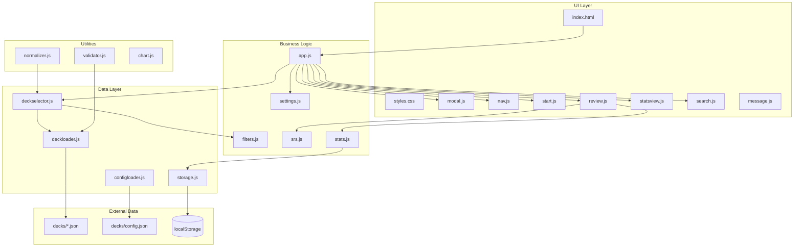
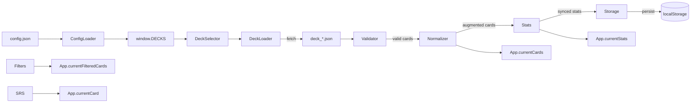

# TM-Flash System Architecture

## Overview
TM-Flash is a single-page application built with vanilla JavaScript, using a modular object-literal pattern. All modules are loaded globally in a specific order via script tags in [`index.html`](index.html).

## Architecture Diagram



## Script Loading Order
Critical dependency order defined in [`index.html`](index.html:11-30):

```
1. chart.js          - Chart.js library for statistics visualization
2. configloader.js   - Loads deck configuration from config.json
3. constants.js      - App constants, learning modes, deck registry
4. storage.js        - localStorage state management
5. stats.js          - Statistics tracking and persistence
6. srs.js            - Spaced repetition algorithm
7. message.js        - User messaging system
8. normalizer.js     - Pinyin normalization utilities
9. validator.js      - Deck data validation
10. deckloader.js    - Deck fetching with error handling
11. deckselector.js  - Deck selection UI and loading
12. settings.js      - User settings management
13. review.js        - Card review interface
14. statsview.js     - Statistics visualization
15. search.js        - Card search functionality
16. filters.js       - Card filtering logic
17. modal.js         - Settings modal management
18. nav.js           - Navigation between views
19. start.js         - Start screen management
20. app.js           - Main application initialization
```

## Module Relationships

### Core Application Module
[`app.js`](app.js) - Central state container and initialization orchestrator

**State Properties:**
- `currentCards` - Array of cards from loaded deck
- `currentFilteredCards` - Cards after filter application
- `currentStats` - Statistics object for current deck
- `currentCard` - Currently displayed card
- `currentMode` - Active learning mode ID
- `currentDeckId` - Active deck identifier
- `flipped` - Card flip state

**Initialization Flow:**
1. Show loading progress
2. Load deck configuration via [`ConfigLoader.load()`](configloader.js:4)
3. Initialize storage via [`Storage.loadState()`](storage.js:31)
4. Initialize deck selector via [`DeckSelector.init()`](deckselector.js:6)
5. Initialize settings via [`Settings.init()`](settings.js:3)
6. Initialize navigation via [`Nav.init()`](nav.js:4)
7. Initialize start screen via [`Start.init()`](start.js:5)
8. Initialize review via [`Review.init()`](review.js:3)
9. Initialize stats view via [`StatsView.init()`](statsview.js:4)
10. Initialize search via [`Search.init()`](search.js:5)
11. Initialize modal via [`Modal.init()`](modal.js:5)

### Data Flow



### Key Module Responsibilities

| Module | Responsibility |
|--------|----------------|
| [`storage.js`](storage.js) | localStorage CRUD with schema versioning |
| [`stats.js`](stats.js) | Per-card, per-mode statistics tracking |
| [`srs.js`](srs.js) | Spaced repetition interval calculation and card selection |
| [`deckloader.js`](deckloader.js) | HTTP fetch with timeout and error handling |
| [`deckselector.js`](deckselector.js) | Deck loading, validation, and UI synchronization |
| [`filters.js`](filters.js) | Tag and HSK level filtering |
| [`review.js`](review.js) | Card rendering, flip logic, user response handling |
| [`nav.js`](nav.js) | View switching and state preservation |
| [`modal.js`](modal.js) | Settings modal with deck/filter/mode controls |
| [`settings.js`](settings.js) | Learning mode application |
| [`search.js`](search.js) | Card search with pinyin/English modes |
| [`statsview.js`](statsview.js) | Statistics charts and metrics display |
| [`start.js`](start.js) | Start screen with deck info and due count |

## Data Structures

### Deck JSON Format
```json
{
  "type": "word",
  "deck_name": "Deck Name",
  "created_at": "ISO timestamp",
  "version": "2",
  "description": "Deck description",
  "audio_path": "decks/deck_audio",
  "cards": [
    {
      "card_id": "unique_id",
      "hanzi": "中文",
      "pinyin": "zhōng wén",
      "tones": "1 2",
      "def": "Chinese language",
      "def_words": ["Chinese", "language"],
      "pos": "noun",
      "hsk": "HSK 1",
      "tags": ["topic1"],
      "audio": "audio_file.mp3"
    }
  ]
}
```

### localStorage Schema (v4)
```javascript
{
  schema_version: 4,
  settings: {
    mode: "LM-hanzi-first",
    selected_deck: "deck_a",
    theme: "light",
    showProgress: true,
    filters: {
      deck_a: { tags: [], hsk: [] }
    }
  },
  decks: {
    deck_a: {
      cards: {
        "card_id": {
          "LM-hanzi-first": {
            total_correct: 0,
            total_incorrect: 0,
            last_correct_at: null,
            last_incorrect_at: null,
            correct_streak_len: 0,
            incorrect_streak_len: 0,
            correct_streak_started_at: null,
            incorrect_streak_started_at: null
          },
          "LM-listening": { /* same structure */ },
          "LM-meaning-to-chinese": { /* same structure */ },
          "LM-pronunciation": { /* same structure */ }
        }
      }
    }
  }
}
```

## SRS Algorithm

### Interval Calculation
[`SRS.calculateNextReviewInterval()`](srs.js:2) uses:
- **Base intervals**: 0.5h, 4h, 24h, 72h, 168h, 336h, 720h, 1440h
- **Correct streak**: Index into base intervals
- **Modifiers**:
  - Recent incorrect: ×0.3
  - High accuracy (≥90%): ×1.3
  - Low accuracy (<50%): ×0.4
  - Incorrect streak: ×0.5^n
  - Long correct streak (>5): up to ×2.0

### Card Selection Priority
[`SRS.selectNextCard()`](srs.js:73) scoring:
1. **New cards**: 1500 points
2. **Recent failures**: 500 + streak×100 points
3. **Overdue factor**: 10×hours overdue
4. **Low accuracy boost**: (0.6-accuracy)×200
5. **Random tie-breaker**: 0-5 points

## Views and Routing

| View ID | Component | Path |
|---------|-----------|------|
| `start` | [`Start`](start.js) | Default on state change |
| `review` | [`Review`](review.js) | Flashcard interface |
| `search` | [`Search`](search.js) | Card search |
| `stats` | [`StatsView`](statsview.js) | Statistics dashboard |

Navigation managed by [`Nav.show(viewId)`](nav.js:33) with state preservation for review view.

## Error Recovery Mechanisms
- **Graceful Degradation**: Fallback to FALLBACK_DECKS when config.json unavailable
- **User-Friendly Messaging**: Error banners via [`Message.show()`](message.js) for failed operations
- **Data Validation**: Comprehensive validation via [`Validator.validateDeck()`](validator.js) and [`Validator.validateCard()`](validator.js)
- **Async Error Handling**: Try/catch blocks in all async operations with descriptive error logging

## Performance Optimization Strategies
- **Loading Progress Indicators**: Session-based deck caching with progress bars during initialization
- **Efficient DOM Manipulation**: Minimal reflows, targeted updates using `textContent` over `innerHTML`
- **Memory Management**: Garbage collection friendly data structures, <2s load targets for 1000 cards
- **Audio Caching**: Hashed filenames for efficient browser caching and storage
- **SRS Prioritization**: Smart card selection algorithm reducing unnecessary computations