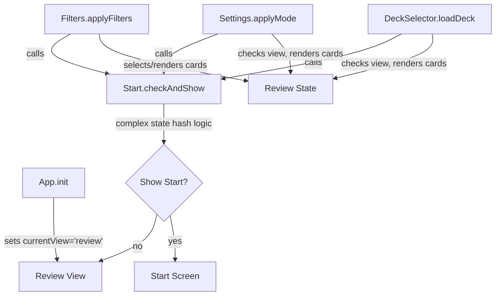
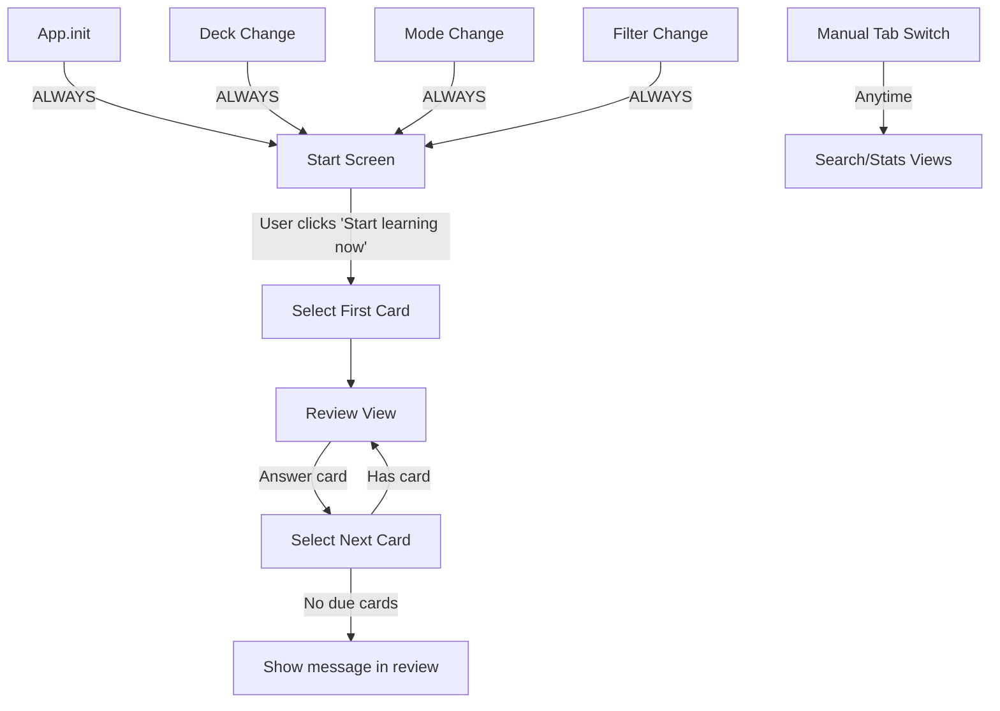

# TM-Flash: Start Screen Always-Show Architectural Refactor Plan

## Executive Summary

This plan details the changes needed to modify TM-Flash's UX so that after app opening or reloading, the app state (regardless of current learning mode) always starts in the start window, showing either 'Start learning now' info or 'No due cards' message.

## Problem Analysis

### Current Issues

1. **Fragmented Control Flow**: Multiple modules (DeckSelector, Settings, Filters) contain logic that directly manipulates review state and decides when to show start vs. review screen
2. **Circular Dependencies**: Start.checkAndShow() is called from 3 different places, creating tight coupling
3. **Complex Conditional Logic**: Start.shouldShowStartScreen() with state hashing makes it difficult to predict behavior
4. **Mixed Responsibilities**: Modules that should only manage data (DeckSelector, Settings, Filters) also handle view transitions
5. **Inconsistent Entry Point**: App defaults to review view, contradicting the desired UX of always starting at start screen

### Current Control Flow Problems



**Issues:**
- 4 different code paths manipulate review state
- Start screen shown conditionally based on complex hashing
- No single source of truth for navigation decisions

## Desired Control Flow



**Benefits:**
- Single, predictable entry point (start screen)
- Clear separation: data changes → start screen, user action → review
- No conditional logic for view switching
- Eliminated circular dependencies

## Code Changes by Module

### 1. app.js

**Current State:**
```javascript
// Line 54
Nav.currentView = 'review';

// Line 57
App.isInitializing = false;
```

**Changes:**
```javascript
// Replace line 54 with:
// Show start screen after initialization
Nav.show('start');

// Keep line 57
App.isInitializing = false;
```

**Rationale:** This ensures the app ALWAYS starts at the start screen after loading, regardless of saved state.

---

### 2. start.js

**Current State:** 119 lines with complex conditional logic

**Changes:**

**DELETE:**
- Line 3: `lastStateHash: null` (no longer needed)
- Lines 18-39: `shouldShowStartScreen()` method (entire method)
- Lines 41-49: `getStateHash()` method (entire method)
- Lines 111-118: `checkAndShow()` method (entire method)

**KEEP:**
- Lines 5-16: `init()` and `bindEvents()` (unchanged)
- Lines 51-103: `render()` method (with modifications below)
- Lines 105-108: `startLearning()` method (unchanged)

**MODIFY render() method:**
```javascript
render() {
  if (!App.currentDeck || !App.currentCards || !App.currentStats) {
    return;
  }

  const filteredCards = Filters.getFilteredCards();
  const dueCount = SRS.countDueCards(filteredCards, App.currentStats.cards, App.currentMode);

  // Deck info
  const deckInfo = document.getElementById('start-deck-info');
  if (deckInfo) {
    deckInfo.textContent = `Current deck: '${App.currentDeck.deck_name}'`;
  }

  // Filters info
  const filtersInfo = document.getElementById('start-filters-info');
  if (filtersInfo) {
    const filterParts = [];
    if (Filters.selectedTags.size > 0) {
      filterParts.push(`Tags: ${Array.from(Filters.selectedTags).join(', ')}`);
    }
    if (Filters.selectedHskLevels.size > 0) {
      filterParts.push(`HSK: ${Array.from(Filters.selectedHskLevels).join(', ')}`);
    }
    filtersInfo.textContent = filterParts.length > 0 ? `Filters applied: ${filterParts.join(', ')}` : 'No filters applied';
  }

  // Mode info
  const modeInfo = document.getElementById('start-mode-info');
  if (modeInfo) {
    const mode = LEARNING_MODES[App.currentMode];
    if (mode) {
      modeInfo.textContent = `Learning mode: ${mode.name} ${mode.description}`;
    }
  }

  // Cards due info - UPDATED to show message for both states
  const cardsDue = document.getElementById('start-cards-due');
  if (cardsDue) {
    if (dueCount > 0) {
      cardsDue.textContent = `${dueCount} card${dueCount > 1 ? 's' : ''} due now.`;
    } else {
      const nextReviewInfo = SRS.getNextReviewInfo(filteredCards, App.currentStats.cards, App.currentMode);
      if (nextReviewInfo) {
        cardsDue.textContent = `No cards due now. Next review: ${nextReviewInfo.cardsInWindow} card${nextReviewInfo.cardsInWindow > 1 ? 's' : ''} in ~${nextReviewInfo.timeString}.`;
      } else {
        cardsDue.textContent = 'No cards due with current filters.';
      }
    }
  }

  // Start button - show/hide based on due cards
  const startBtn = document.getElementById('start-learning-btn');
  if (startBtn) {
    if (dueCount > 0) {
      startBtn.style.display = 'block';
      startBtn.textContent = 'Start learning now';
    } else {
      startBtn.style.display = 'none';
    }
  }
}
```

**New file size:** ~80 lines (reduced from 119)

**Rationale:** Eliminates all conditional "should I show" logic. Start screen always shows when rendered, with appropriate messaging for both "cards due" and "no cards due" states.

---

### 3. deckselector.js

**Changes in loadDeck() method:**

**DELETE:**
- Lines 238-264: Entire block checking `if (Nav.currentView === 'review')` and manipulating review state
- Line 285: `Start.checkAndShow();` call

**ADD after line 236 (after modal filter update):**
```javascript
// Always show start screen after deck loads
Nav.show('start');
```

**Modified code section (lines 233-290):**
```javascript
// Update modal filters if modal is open
if (Modal.isOpen) {
  Modal.updateFiltersInModal();
}

// Always show start screen after deck loads
Nav.show('start');

// Ensure selector shows current selection
const selector = document.getElementById("modal-deck-selector");
if (selector && selector.value !== deckId) {
  selector.value = deckId;
}

// Reset review view to show first card (only resets state, doesn't navigate)
this.resetReviewView();

// Re-render stats view so visuals update for the newly loaded deck
try {
  if (typeof StatsView !== 'undefined' && StatsView.render) {
    StatsView.render();
  }
} catch (e) {
  console.warn('StatsView.render failed after deck load:', e);
}

this.setStatusMessage(
  `Loaded ${deckId} (${augmentedCards.length} cards)`,
  "success",
);
console.log(`Successfully loaded deck: ${deckId} with ${augmentedCards.length} cards`);
```

**Rationale:** DeckSelector should ONLY load data, not decide where to navigate. After loading, always show start screen to let user review changes and decide when to start learning.

---

### 4. settings.js

**Changes in applyMode() method:**

**DELETE:**
- Lines 29-56: Entire block checking `if (App.currentCards && App.currentStats && Nav.currentView === 'review')`
- Line 64: `Start.checkAndShow();` call

**KEEP:**
- Lines 18-28: Mode validation and App.currentMode/flipped setting
- Lines 59-61: Stats view re-render if in stats view

**ADD after line 61:**
```javascript
// Always show start screen after mode change
Nav.show('start');
```

**Modified applyMode() method:**
```javascript
applyMode(mode) {
  // Check if mode is a valid learning mode id
  const validMode = LEARNING_MODES[mode];
  if (!validMode) {
    console.warn(`Invalid mode '${mode}', using default`);
    mode = DEFAULT_MODE.id;
  }
  App.currentMode = mode;
  App.flipped = false;

  // Re-render stats if in stats view
  if (Nav.currentView === 'stats') {
    StatsView.render();
  }

  // Always show start screen after mode change
  Nav.show('start');
}
```

**New method size:** ~15 lines (reduced from ~48 lines)

**Rationale:** Mode change should not manipulate review state. Simply update the mode setting and show start screen so user can see the mode change and start when ready.

---

### 5. filters.js

**Changes in applyFilters() method:**

**DELETE:**
- Line 77: `Start.checkAndShow();` call
- Lines 79-100: Entire block selecting/rendering cards if current card not in filtered set

**ADD after line 69 (after Review.updateReviewTogglesDisplay):**
```javascript
// Always show start screen after filter change
Nav.show('start');
```

**Modified applyFilters() method:**
```javascript
applyFilters() {
  if (!App.currentCards || !App.currentCards.length) return;

  let filteredCards = App.currentCards;

  // Apply tag filter
  if (this.selectedTags.size > 0) {
    filteredCards = filteredCards.filter(card =>
      card.tags && card.tags.some(tag => this.selectedTags.has(tag))
    );
  }

  // Apply HSK filter
  if (this.selectedHskLevels.size > 0) {
    filteredCards = filteredCards.filter(card =>
      card.hsk && this.selectedHskLevels.has(card.hsk)
    );
  }

  // Update app state with filtered cards
  App.currentFilteredCards = filteredCards;

  // Update review display
  Review.updateReviewTogglesDisplay();

  // Re-render stats if in stats view
  if (Nav.currentView === 'stats') {
    StatsView.render();
  }

  // Always show start screen after filter change
  Nav.show('start');
}
```

**New method size:** ~30 lines (reduced from ~56 lines)

**Rationale:** Filter changes should not auto-select cards. Show start screen so user can see filtered card count and decide when to start.

---

### 6. nav.js

**Major simplification of show() method:**

**DELETE:**
- Lines 35-39: Saved review state logic (no longer needed)
- Lines 82-132: Entire review view handling block with deck loading, state restoration, card selection

**REPLACE review handling (lines 82-132) with:**
```javascript
// Handle review view - simplified, passive rendering only
if (viewId === "review") {
  if (App.currentCard) {
    Review.renderCard(App.currentCard);
  } else {
    // Show message that no card is selected
    Review.renderCard(null);
    Message.show('review', 'No card selected. Use the Start screen or answer cards to begin review.');
  }
}
```

**Modified show() method:**
```javascript
async show(viewId) {
  this.currentView = viewId;  // Update current view tracker

  // Hide all views
  const views = document.querySelectorAll(".view");
  views.forEach((view) => view.classList.add("is-hidden"));

  // Show selected view
  const selectedView = document.getElementById(`view-${viewId}`);
  if (selectedView) {
    selectedView.classList.remove("is-hidden");
    if (viewId === "search") {
      document.getElementById("search-query").focus();
    }
  }

  // Update active tab
  const tabs = document.querySelectorAll(".tab");
  tabs.forEach((tab) => tab.classList.remove("active"));

  const activeTab = document.querySelector(`[data-view="${viewId}"]`);
  if (activeTab) {
    activeTab.classList.add("active");
  }

  // Toggle visibility of review toggles
  const reviewToggles = document.getElementById('review-toggles');
  if (viewId === 'review' || viewId === 'stats') {
    reviewToggles.classList.remove('is-hidden');
  } else {
    reviewToggles.classList.add('is-hidden');
  }

  // Render stats if showing stats view
  if (viewId === "stats") {
    StatsView.render();
  }

  // Render start screen if showing start view
  if (viewId === "start") {
    Start.render();
  }

  // Handle review view - simplified, passive rendering only
  if (viewId === "review") {
    if (App.currentCard) {
      Review.renderCard(App.currentCard);
    } else {
      // Show message that no card is selected
      Review.renderCard(null);
      Message.show('review', 'No card selected. Use the Start screen or answer cards to begin review.');
    }
  }
}
```

**DELETE entirely:**
- Lines 135-145: `showNoCardsMessage()` method (no longer needed, handled in review view or start screen)

**New show() method size:** ~50 lines (reduced from ~100+ lines)

**Rationale:** Nav.show() should be passive - it shows a view but doesn't load data or make decisions. Review view simply displays whatever card is selected, if any.

---

### 7. start.js - Additional Change to startLearning()

**Current startLearning() method:**
```javascript
startLearning() {
  // Transition to review view
  Nav.show('review');
}
```

**Enhanced startLearning() method:**
```javascript
startLearning() {
  // Select first due card before transitioning to review
  const filteredCards = Filters.getFilteredCards();
  App.currentCard = SRS.selectNextCard(
    filteredCards,
    App.currentStats.cards,
    App.currentMode
  );
  App.flipped = false;
  
  // Transition to review view
  Nav.show('review');
}
```

**Rationale:** Since review view is now passive, start button must select the first card before transitioning. This ensures review view has a card to display.

---

### 8. index.html

**Change:**
Line 39, change review tab from active to inactive:
```html
<!-- Current: -->
<button class="tab active" data-view="review">Review</button>

<!-- New: -->
<button class="tab" data-view="review">Review</button>
```

**Rationale:** Start screen should be the default, so review tab shouldn't be marked as visually active on load.

---

## Summary of Redundancies Eliminated

### Code Removed

1. **start.js**: 39 lines removed
   - `lastStateHash` property
   - `shouldShowStartScreen()` method
   - `getStateHash()` method
   - `checkAndShow()` method

2. **deckselector.js**: 28 lines removed
   - Review view conditional manipulation block
   - `Start.checkAndShow()` call

3. **settings.js**: 32 lines removed
   - Review view conditional manipulation block
   - `Start.checkAndShow()` call

4. **filters.js**: 22 lines removed
   - Card selection/rendering block
   - `Start.checkAndShow()` call

5. **nav.js**: 55+ lines removed
   - Saved review state management
   - Automatic deck loading logic
   - State restoration logic
   - Card selection in review view
   - `showNoCardsMessage()` method

**Total: ~176 lines of code removed**

### Circular Dependencies Eliminated

**Before:**
- DeckSelector → Start.checkAndShow() → Nav.show()
- Settings → Start.checkAndShow() → Nav.show()
- Filters → Start.checkAndShow() → Nav.show()
- Nav.show('review') → DeckSelector.loadDeck() (conditionally)

**After:**
- DeckSelector → Nav.show('start')
- Settings → Nav.show('start')
- Filters → Nav.show('start')
- Nav.show() has no circular dependencies

### Responsibilities Clarified

| Module | Before | After |
|--------|--------|-------|
| **DeckSelector** | Load data + decide view + render cards | Load data only |
| **Settings** | Apply mode + decide view + render cards | Apply mode only |
| **Filters** | Filter data + decide view + select/render cards | Filter data only |
| **Start** | Complex conditional show logic | Simple render when shown |
| **Nav** | View switching + data loading + state restoration | View switching only |
| **Review** | Render cards | Render cards (unchanged) |

## Migration Path

### Phase 1: Testing Preparation
1. Document current behavior with screenshots/videos
2. Create manual test checklist covering:
   - App load/reload
   - Deck switching
   - Mode switching
   - Filter changes
   - Tab navigation
   - Card answering flow

### Phase 2: Implementation Order
1. **Start with nav.js**: Simplify Nav.show() first
2. **Then start.js**: Remove conditional logic
3. **Then app.js**: Change default view
4. **Then index.html**: Update active tab
5. **Then data modules**: DeckSelector, Settings, Filters
6. **Finally start.js**: Add card selection to startLearning()

### Phase 3: Testing
1. Test app initialization
2. Test all state change scenarios
3. Test tab switching
4. Test "no cards due" scenario
5. Test filter combinations
6. Test browser reload at different states

### Phase 4: Documentation Update
1. Update AGENTS.md with new control flow
2. Update memory bank files
3. Add architectural notes to TECHNICAL-NOTES.md

## Risk Assessment

### Low Risk
- Start screen always showing (desired behavior)
- Reduction in code complexity
- Elimination of race conditions

### Medium Risk
- User muscle memory (if they expect review on load)
  - **Mitigation**: Clear "Start learning now" button makes it obvious
- Edge cases with no due cards
  - **Mitigation**: Start screen shows appropriate message

### High Risk
- None identified

## Benefits

1. **Predictability**: User always knows where they'll land (start screen)
2. **Simplicity**: Single entry point, clear navigation flow
3. **Maintainability**: 176 fewer lines, no circular dependencies
4. **Performance**: Fewer unnecessary operations on state changes
5. **Clarity**: Each module has single, well-defined responsibility
6. **Extensibility**: Easy to add new features without breaking navigation

## Conclusion

This architectural refactor significantly simplifies TM-Flash's control flow by:
- Establishing start screen as single entry point
- Eliminating conditional view switching logic
- Removing circular dependencies between modules
- Clarifying module responsibilities
- Reducing codebase by ~176 lines

The changes create a more predictable, maintainable UX where state changes (deck/mode/filters) always return to start screen, and only explicit user action (clicking "Start learning now") begins the review session.